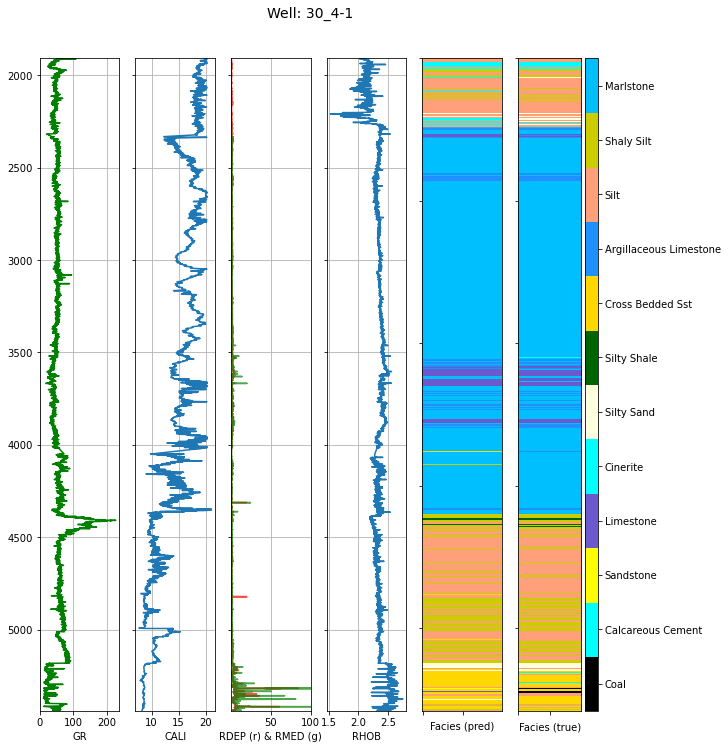
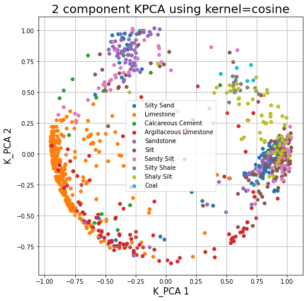
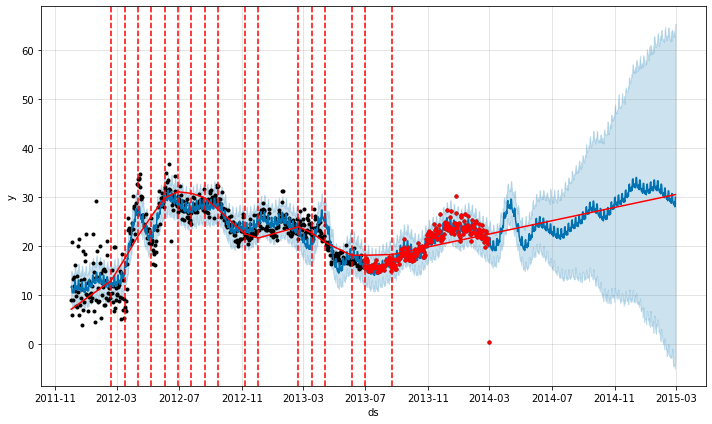

# deep_ml_curriculum

First run of Data science and Machine Learning training for Oil and Gas.

Teaches DS&ML using some Oil and Gas specific datasets and examples. Some of these are well log facies prediction, seismic interpretation, geospatial plotting, production plotting, and more.

[See the Three Springs Technology product page](https://threespringstechnology.com/products/ai-training-courses/) for more information or to schedule this course email [info@threespringscapital.com](mailto:info@threespringscapital.com?subject=deep_ml_curriculum).

<div>





</div>


## Project Organization
------------

    ├── LICENSE
    ├── Makefile           <- Makefile with commands like `make data` or `make train`
    ├── README.md          <- The top-level README for developers using this project.
    ├── data
    │   ├── processed      <- The final, canonical data sets for modeling.
    │   └── raw            <- The original, immutable data dump.
    │
    ├── models             <- Trained and serialized models, model predictions, or model summaries
    │
    ├── notebooks          <- Course notebooks. a is reserved for a python course. b is data science, c is machine learning
    │   ├── b01_SQL        <- Start of Couese b
    │   ├── b02_Advanced_Pandas
    │   ├── b03_Data_Visualisation
    │   ├── b04_DS_Basics
    │   ├── b05_Supervised_Learning
    │   ├── b06_Evaluation_Metrics
    │   ├── b07_Selfsupervised
    │   ├── b08_Interactive_Plotting
    │   ├── b09_Time_Series_Analysis
    │   ├── b10_Time_Series_Forecasting
    │   ├── b11_Geopandas
    │   ├── b12_Final_Project
    │   ├── c01_Intro_to_NN_Part_1
    │   ├── c02_Intro_to_NN_Part_2
    │   ├── c03_Finetuning
    │   ├── c04_Tabular_Data
    │   ├── c05_Big_Data
    │   ├── c06_Hyperparameter_Optimization
    │   ├── c07_Recurrent_Neural_Networks
    │   ├── c08_Object_Detection
    │   ├── c09_Autoencoders
    │   ├── c10_GANs
    │   ├── c11_Final_Project
    │   └── z00_Data_prep  <- Preperation of datasets
    │
    ├── requirements       <- The requirements files for reproducing the analysis environment, e.g.
    │                         generated with `make doc_reqs`
    │
    ├── setup.py           <- makes project pip installable (pip install -e .) so src can be imported
    ├── deep_ml_curriculum <- Source code for use in this project.
    │   ├── __init__.py    <- Makes src a Python module
    │   │
    │   ├── data           <- Scripts to download or generate data
    │   │   └── make_dataset.py
    │   │
    │   ├── features       <- Scripts to turn raw data into features for modeling
    │   │   └── build_features.py
    │   │
    │   ├── models         <- Scripts to train models and then use trained models to make
    │   │   │                 predictions
    │   │   ├── predict_model.py
    │   │   └── train_model.py
    │   │
    │   └── visualization  <- Scripts to create exploratory and results oriented visualizations
    │       └── visualize.py


# Setup the data

The data is stored on a public (read only) s3 bucket

```
git clone git@github.com:3springs/deep_ml_curriculum.git
cd <project root>
# install packages in conda
conda env update --file requirements/environment.min.yml
# install the module, as an editable pip module
pip install -e .
# pull raw the data from public s3 bucket (~10Gb)
aws s3 sync s3://deep-ml-curriculum-data/data/processed/ ~/notebooks/deep_ml_curriculum/data/processed/ --region ap-southeast-2 --no-sign-request 
```

# Setup the environment

See [./requirements/readme.md](./requirements/readme.md)

# Contributors ✨

Thanks goes to these wonderful people ([emoji key](https://allcontributors.org/docs/en/emoji-key)):
<!-- ALL-CONTRIBUTORS-LIST:START - Do not remove or modify this section -->
<!-- prettier-ignore-start -->
<!-- markdownlint-disable -->
<table>
  <tr>
    <td align="center"><a href="https://github.com/elcronos"><br /><sub><b>Camilo</b></sub></a><br /><a href="https://github.com/3springs/deep_ml_curriculum/commits?author=elcronos" title="Code">💻</a></td>
    <td align="center"><a href="https://github.com/pooyad359"><br /><sub><b>Pooya</b></sub></a><br /><a href="https://github.com/3springs/deep_ml_curriculum/commits?author=pooyad359" title="Code">💻</a></td>
    <td align="center"><a href="https://github.com/wassname"><br /><sub><b>Mike C</b></sub></a><br /><a href="https://github.com/3springs/deep_ml_curriculum/commits?author=wassname" title="Code">💻</a></td>
    <td align="center"><a href="https://github.com/Assistedevolution"><br /><sub><b>Sean Driver</b></sub></a><br /><a href="https://github.com/3springs/deep_ml_curriculum/commits?author=Assistedevolution" title="projectManagement">📆</a></td>
    <td align="center"><a href="https://github.com/the-winter"><br /><sub><b>the-winter</b></sub></a><br /><a href="https://github.com/3springs/deep_ml_curriculum/commits?author=the-winter" title="review">📆</a></td>

  </tr>
</table>
<!-- markdownlint-enable -->
<!-- prettier-ignore-end -->
<!-- ALL-CONTRIBUTORS-LIST:END -->


Made by <a href="https://threespringstechnology.com/"></a>


# Credits

Many of the datasets or notebooks are based on resources that were generously made open source by the authors. These are aknowledged either in a readme file associated with the data, in the notebook, or at the end of the notebook.

<p><small>Project based on the <a target="_blank" href="https://drivendata.github.io/cookiecutter-data-science/">cookiecutter data science project template</a>. #cookiecutterdatascience</small></p>
